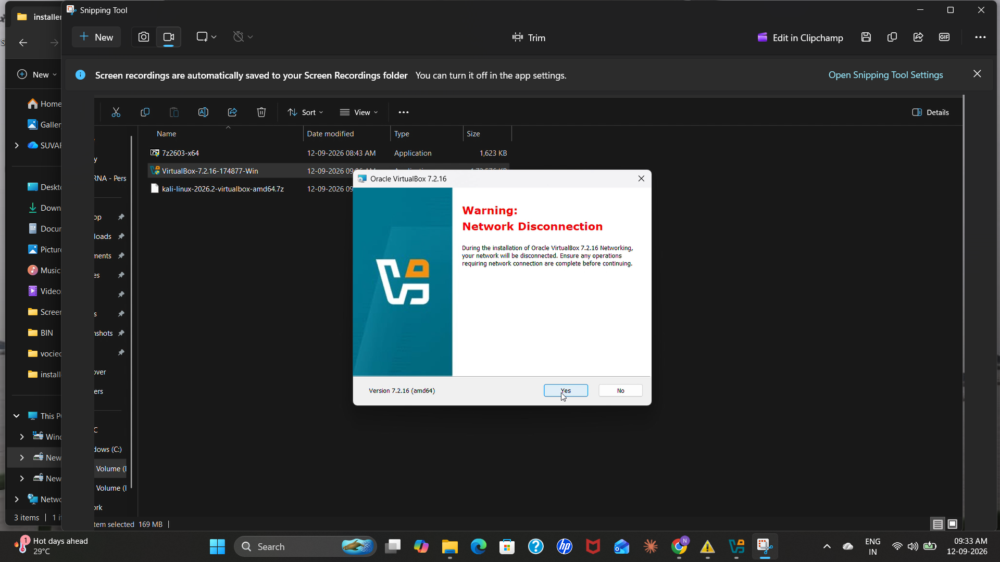
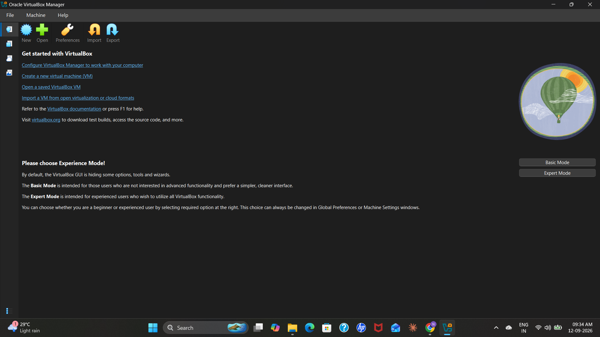
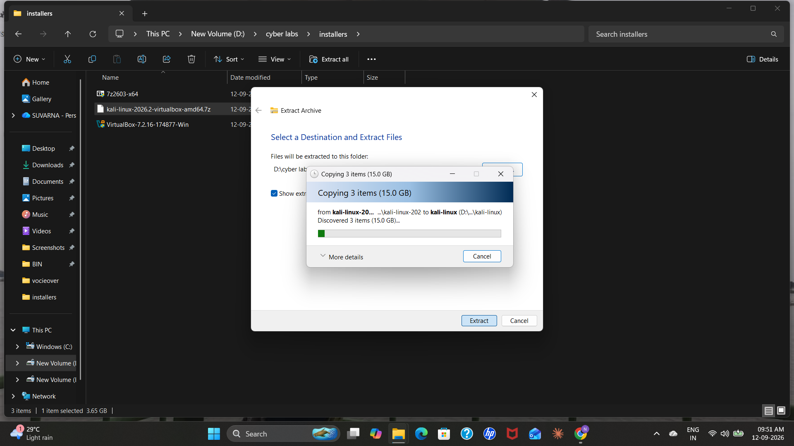
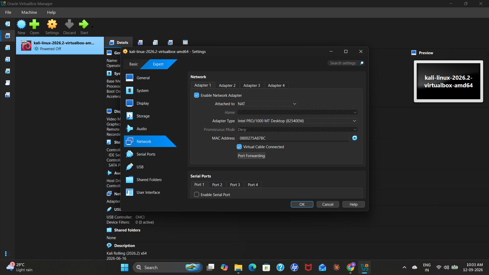
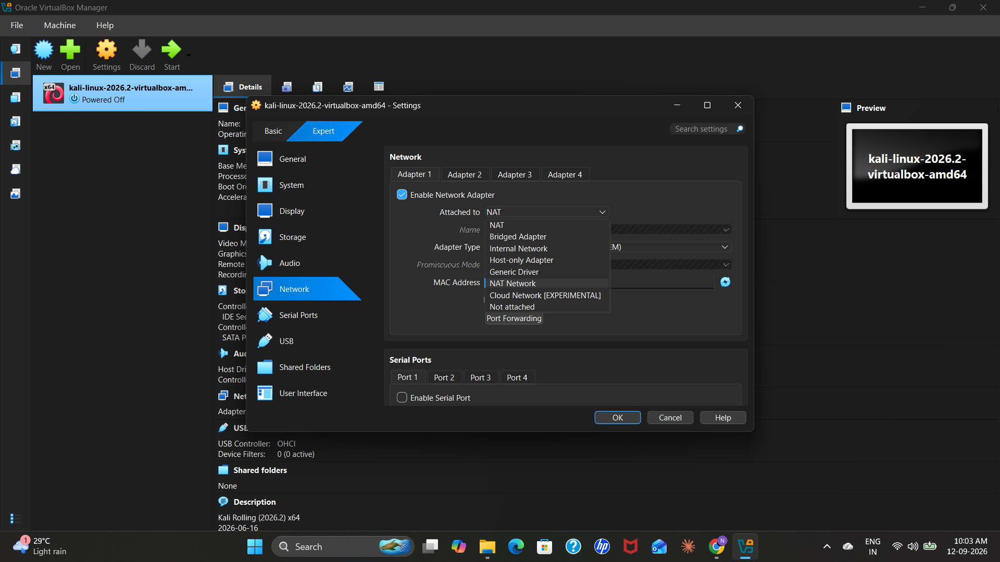
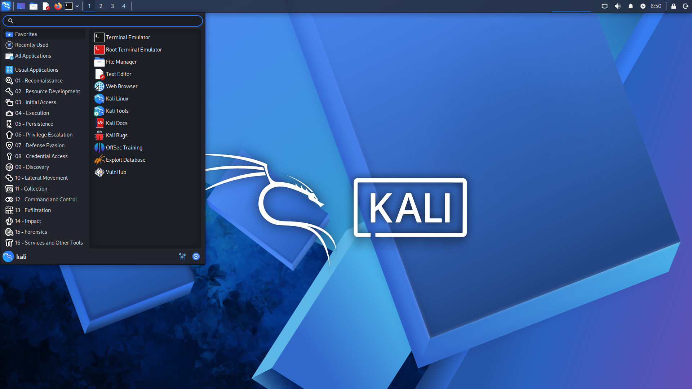

# 🛡️ Week 1 — Cybersecurity Lab Setup

> **NetworkWalks Cybersecurity Internship Batch 083| Week 1 Project**
> Setting up a professional penetration testing environment using Kali Linux, Oracle VirtualBox, and NAT Networking.

---

## 📋 Table of Contents

1. [Introduction](#introduction)
2. [Objectives](#objectives)
3. [Tools & Technologies](#tools--technologies)
4. [System Requirements](#system-requirements)
5. [Setup Walkthrough](#setup-walkthrough)
   - [Step 1 — Installing 7-Zip](#step-1--installing-7-zip)
   - [Step 2 — Installing Oracle VirtualBox](#step-2--installing-oracle-virtualbox)
   - [Step 3 — Extracting Kali Linux](#step-3--extracting-kali-linux)
   - [Step 4 — Configuring the NAT Network](#step-4--configuring-the-nat-network)
   - [Step 5 — Configuring the Kali Linux Network Adapter](#step-5--configuring-the-kali-linux-network-adapter)
   - [Step 6 — Starting Kali Linux](#step-6--starting-kali-linux)
   - [Step 7 — Verifying Network Configuration](#step-7--verifying-network-configuration)
   - [Step 8 — Additional Network Parameters](#step-8--additional-network-parameters)
   - [Step 9 — Creating a Snapshot](#step-9--creating-a-snapshot)
6. [Challenges & Solutions](#challenges--solutions)
7. [Results](#results)
8. [Key Takeaways](#key-takeaways)
9. [Conclusion](#conclusion)

---

## Introduction

As part of the **NetworkWalks Cybersecurity Internship — Week 1**, this project documents the complete setup of a professional cybersecurity practice environment. The environment is built using **Kali Linux** running inside **Oracle VirtualBox** on a Windows host machine, configured with a **NAT Network** for isolated and controlled network access.

This setup forms the foundational infrastructure for all upcoming penetration testing and cybersecurity lab exercises.

---

## Objectives

The primary objectives of this lab setup were:

- ✅ Install and configure **Oracle VirtualBox** on a Windows host
- ✅ Deploy **Kali Linux 2026.2** as a virtual machine
- ✅ Understand the fundamentals of **virtualization** in a security context
- ✅ Configure a **NAT Network** in VirtualBox for isolated connectivity
- ✅ Connect the Kali Linux VM to the configured NAT Network
- ✅ Verify network configuration and connectivity from within Kali Linux
- ✅ Create a **snapshot** for safe rollback during future experiments
- ✅ Document the entire lab setup for reproducibility

---

## Tools & Technologies

| Tool / Technology | Version / Details | Purpose |
|---|---|---|
| Kali Linux | 2026.2 | Primary penetration testing OS |
| Oracle VirtualBox | Latest | Hypervisor / VM management |
| 7-Zip | Latest | Extracting `.7z` compressed archives |
| Windows | Host OS | Base operating system |
| NAT Network | `10.0.0.0/24` | Isolated virtual network |
| GitHub | — | Project documentation & version control |

---

## System Requirements

| Component | Minimum | Recommended |
|---|---|---|
| RAM | 4 GB | 8 GB+ |
| Storage | 20 GB free | 50 GB+ free |
| CPU | Dual-core with VT-x | Quad-core with VT-x/AMD-V |
| OS | Windows 10 | Windows 10/11 64-bit |

---

## Setup Walkthrough

### Step 1 — Installing 7-Zip

7-Zip was installed first as it is required to extract the Kali Linux VirtualBox package, which is delivered as a `.7z` compressed archive.

**Download:** [https://www.7-zip.org](https://www.7-zip.org)

---

### Step 2 — Installing Oracle VirtualBox

Oracle VirtualBox was installed on the Windows host system to serve as the hypervisor for running the Kali Linux virtual machine.

**Download:** [https://www.virtualbox.org](https://www.virtualbox.org)




---

### Step 3 — Extracting Kali Linux

The Kali Linux VirtualBox image was provided as a `.7z` archive. Using 7-Zip, the archive was extracted to reveal the virtual machine configuration files and virtual disk image (`.vdi`).



---

### Step 4 — Configuring the NAT Network

Before attaching the network adapter to the VM, a dedicated NAT Network was created in VirtualBox via **Tools → Network Manager → NAT Networks**.

**NAT Network Configuration:**

| Parameter | Value |
|---|---|
| Network Name | `NatNetwork` |
| IPv4 Prefix | `10.0.0.0/24` |
| DHCP | Enabled |


---

### Step 5 — Configuring the Kali Linux Network Adapter

With the NAT Network ready, the Kali Linux VM settings were opened in VirtualBox. The network adapter was configured as follows:

| Parameter | Value |
|---|---|
| Adapter | Enabled |
| Attached To | NAT Network |
| Network Name | `NatNetwork` |


---

### Step 6 — Starting Kali Linux

After all configurations were applied, the Kali Linux virtual machine was powered on. Kali Linux booted successfully and the desktop environment loaded without errors.






---

### Step 7 — Verifying Network Configuration

From within the Kali Linux terminal, network configuration and connectivity were verified using standard Linux networking commands.

```bash
# Display network interfaces and assigned IP addresses
ip addr

# Display the routing table
ip route

# Test internet connectivity
ping -c 4 8.8.8.8
```

The output confirmed that the virtual machine received an IP address from the DHCP server and was connected to the NAT Network successfully.

---

### Step 8 — Additional Network Parameters

The following network parameters were observed and verified on the Kali Linux VM:

| Parameter | Value |
|---|---|
| IP Address | `10.0.0.2` |
| Default Gateway | `10.0.0.1` |
| DNS Server | `8.8.8.8` |

---

### Step 9 — Creating a Snapshot

After confirming a fully functional lab environment, a **VirtualBox snapshot** was taken. This snapshot captures the clean, working state of the VM and can be used to instantly restore the environment if it becomes corrupted or misconfigured during future labs.


---

## Challenges & Solutions

| # | Challenge | Solution |
|---|---|---|
| 1 | Could not locate the Network Manager in VirtualBox | Found it under **Tools → Network Manager** in the VirtualBox menu bar |


---

## Results

The cybersecurity lab environment was **successfully configured** with the following outcomes:

- ✅ Kali Linux 2026.2 is running inside Oracle VirtualBox
- ✅ The VM is connected to the `NatNetwork` NAT Network (`10.0.0.0/24`)
- ✅ Network connectivity and IP assignment verified from within Kali Linux
- ✅ A clean snapshot was saved for quick restoration during future labs

---

## Key Takeaways

Through this project, the following skills and concepts were gained:

- 🔧 Installing and configuring **Oracle VirtualBox** as a hypervisor
- 📦 Using **7-Zip** to extract `.7z` compressed VM archives
- 🐉 Deploying **Kali Linux** as a virtual machine from a pre-built image
- 🌐 Understanding **NAT Networking** in a virtualized environment
- 🔌 Connecting a VM to a virtual NAT Network for isolated lab access
- 🖥️ Using Linux networking commands (`ip addr`, `ip route`) for diagnostics
- 📸 Creating **VirtualBox snapshots** for safe experimentation
- 📝 Documenting technical lab setups professionally using **GitHub**

---

## Conclusion

This Week 1 project established the core infrastructure needed for all future cybersecurity labs in the NetworkWalks internship. By successfully deploying Kali Linux inside a VirtualBox NAT Network, a fully isolated and restorable penetration testing environment is now operational.

The environment is ready for use in upcoming labs covering topics such as network scanning, vulnerability assessment, and ethical hacking exercises.

---

<div align="center">

**NetworkWalks Cybersecurity Internship — Week 1**

</div>
